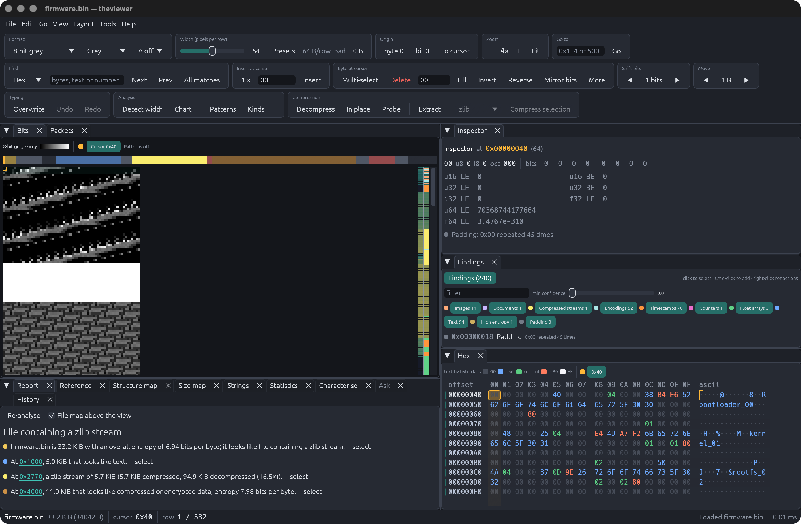
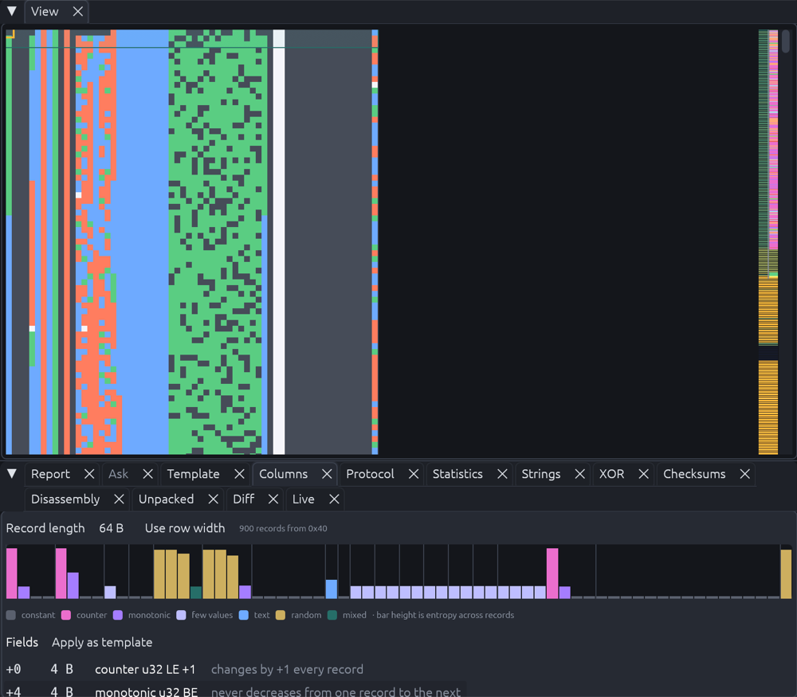
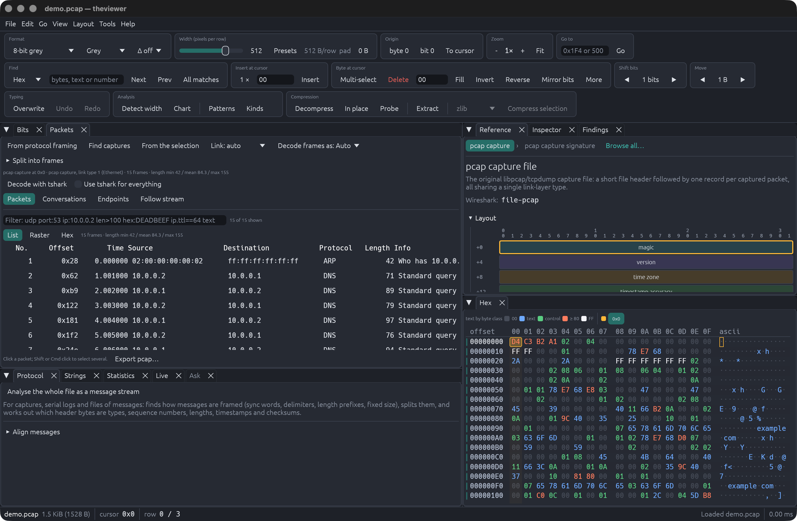
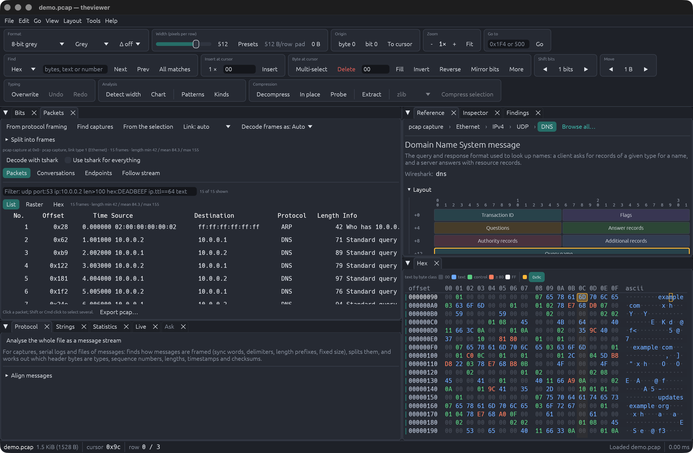

# theviewer

**See the structure in any file.** theviewer draws a file's bytes as pixels,
so headers, tables, text, images and compressed data show up as shapes you
can recognise. Set the width to the record size and the data lines up into
columns. Then inspect, analyse and edit it: dissect the packets inside, read
what each field means and which RFC defines it, and save the steps as a
recipe to run on the next file.

It is built for reverse-engineering file formats, firmware images, captures
and logs, and it stays fast on files of many gigabytes.



<sub>A firmware image at 64 bytes per row. The report at the bottom names
what the file contains and where; every offset is a link.</sub>

## Contents

- [Install](#install)
- [A quick tour](#a-quick-tour)
- [What it can do](#what-it-can-do)
- [The user guide](#the-user-guide)
- [Keyboard shortcuts](#keyboard-shortcuts)
- [Licence](#licence)

## Install

**macOS on Apple silicon.** Download `theviewer-VERSION-macos-arm64.tar.gz`
from the [releases page](https://github.com/benjaminr/theviewer/releases),
then:

```sh
tar -xzf theviewer-0.3.1-macos-arm64.tar.gz
xattr -d com.apple.quarantine theviewer-0.3.1-macos-arm64/theviewer   # the binary is not signed
./theviewer-0.3.1-macos-arm64/theviewer path/to/file.bin
```

**From source, anywhere else.** You need a Rust toolchain
([rustup](https://rustup.rs)). Then:

```sh
git clone https://github.com/benjaminr/theviewer
cd theviewer
cargo build --release
./target/release/theviewer path/to/file.bin
```

You can also drop a file onto the window, or press `Cmd+O`. Video playback
uses `ffmpeg` if it is installed, and the packet viewer can use Wireshark's
`tshark` if you ask it to; everything else is built in.

## A quick tour

1. **Open a file.** Each byte becomes a pixel, row by row. The strip beside
   the scrollbar maps the whole file by entropy: dark for empty space, teal
   for structured data, amber to white for compressed or encrypted data.
2. **Find the width.** Press *Detect width*. theviewer looks for repeating
   patterns and suggests record sizes; pick one and the data snaps into
   columns. You can also drag the *Width* slider, or step it with `[` and
   `]`.
3. **Read what is there.** Click any pixel. The *Inspector* shows that byte
   as every common number type, and the field tree of any structure it
   recognises. *Findings* lists everything detected nearby: counters,
   timestamps, text, signatures and compressed streams. *Report* describes
   the whole file in plain sentences, each linked to its bytes.
4. **Dig into the records.** *Columns* profiles each byte position across
   the records and turns what it finds into a template you can apply in one
   click.

   

5. **Open the packets.** In a capture or a stream of messages, the
   *Packets* tab beside the view lists the packets and dissects each one,
   layer by layer. Filter them with Wireshark's field names, such as
   `dns.qry.name~example`, or split frames out of any file.

   

6. **Learn what the bytes mean.** The *Reference* tab names every format
   around the cursor (*pcap capture › Ethernet II › IPv4 › UDP › DNS*),
   draws its header, explains each field, and links the RFC section that
   defines it.

   

7. **Open what is inside.** Images, audio, video and compressed streams
   buried in the file open where they sit. Put the cursor on one and press
   `Cmd+Enter` to view or play it, or `Cmd+D` to decompress.
8. **Edit it, and keep the steps.** Type hex over a byte, or XOR, fill,
   shift or move a selection. Everything can be undone, and `Cmd+S` saves
   safely through a temporary file. The *History* tab lists every step;
   save them as a recipe and run it on the next file.

Press `Cmd+K` at any time for the command palette, which lists every action
with its shortcut, or right-click a byte for the actions that apply to it.
The **Layout** menu has a layout for each kind of work: network captures,
file formats, firmware, bit streams, forensics and comparing files.

## What it can do

**View and edit**
- Eleven pixel formats from 1-bit to 32-bit colour, *Byte class*, ten
  numeric heatmaps of 16- and 32-bit values, and six palettes.
- Any width, row padding and origin down to the bit; Hilbert and Morton
  curve layouts; a row difference that makes changing fields stand out.
- Range, column (`Alt`+drag) and multi-range selections, shared by the
  raster, the hex dump and the packet viewer.
- One *Selection* menu everywhere: XOR, add, fill, invert, shift and rotate
  bits, swap byte order, number records, move, copy as a C array or
  Base64, compress, and more, as one undo step.
- Unlimited undo on files of any size; skip bytes out of the view without
  deleting them; open embedded images, audio, video and compressed streams
  where they sit.

**Find structure**
- Record-width detection, a plain-language report, and about 600 file
  signatures.
- Field trees for executables, images, archives, captures, certificates,
  disks and schemaless formats.
- Segments, *Find more like this* and feature tracks; column profiles;
  a template language; learning a new format from a few samples.

**Packets and protocols**
- pcap, pcapng, snoop, Network Monitor and ERF captures, gzipped or not,
  found anywhere in a file; frames split out by width, length field or
  pattern.
- Dissectors from Ethernet and IP to DNS, DHCP, SNMP, Modbus/TCP, MQTT,
  S7comm, SMB and RTP; frames of unknown format detected and
  decoded as the protocol they are.
- Filters with Wireshark field names, conversations and streams, editing
  with checksums fixed, pcap export, and optional decoding with tshark.

**Learn as you go**
- Reference notes on about 260 formats and protocols: what each field
  means, an RFC-style header diagram, and the specification it comes from.
- The RFC section itself, fetched when you click.
- Wireshark's display-filter name for each protocol and field, and a
  guess at undissected payloads from the port.
- Your own notes, in the same form.

**Analysis tools**
- 29 tool tabs, among them dot plot, trigram cube, size map, image finder,
  bit planes and line codes, statistics, compressibility and text
  encoding, strings, XOR and cipher attacks, crypto constants, checksums
  and a CRC solver, disassembly, firmware load address, unpacking,
  forensics, diff and comparing many files.

**History and recipes**
- Every step by everyone, in the History tab: undo any step, go back to
  one, or play them back.
- Recipes with anchors (the nth match, a structure field, a finding) and
  parameters, so they work on files where things sit elsewhere.

**Automate**
- `--report` and `--json` for scripts; `theviewer api` runs any of the
  data API's methods from the shell.
- `theviewer mcp` serves files to Claude Code and other MCP clients.
- `theviewer replay` runs a recipe over many files.
- Lua plugins that add detectors, parsers and methods, and *Ask*, which
  answers questions about the file with Claude. You decide what each may
  change.

## The user guide

The [user guide](docs/guide/README.md) covers each part in full:

- [Worksheets](docs/guide/worksheets.md): files and the sheets made from
  them, open side by side, with the worksheet strip and the tree of sheets.
- [Viewing and editing](docs/guide/viewing-and-editing.md): formats, width
  and zoom, selections and the byte operations, compressed streams and
  media.
- [Finding structure](docs/guide/finding-structure.md): width detection,
  Findings, Report, Structure map, Columns, Templates and Learn.
- [Packets](docs/guide/packets.md): captures, splitting frames, *Decode
  frames as*, filters, editing, tshark and export.
- [Reference notes](docs/guide/reference-notes.md): the Reference tab,
  RFCs, Wireshark names and your own notes.
- [The tools](docs/guide/tools.md): every tool tab, in brief.
- [Layouts and the workspace](docs/guide/layouts-and-workspace.md):
  recommended and saved layouts, and what the tools share.
- [History and recipes](docs/guide/history-and-recipes.md): undo, go back,
  playback, and recipes in the window and from the shell.
- [Ask Claude, and who may change the file](docs/guide/ask-and-permissions.md).
- [Command line](docs/guide/command-line.md): every option and subcommand.
- [Settings and files](docs/guide/settings-and-files.md): settings, where
  things are saved, and adding your own formats and plugins.

For building on theviewer: the [data API](docs/api.md),
[plugins](docs/plugins.md), [templates](docs/templates.md), the
[MCP server](docs/mcp.md), the [recipe format](docs/recipes.md) and
[development](docs/development.md).

## Keyboard shortcuts

Shortcuts use `Cmd` on macOS and `Ctrl` elsewhere. Press `?` in the app for
the full list.

| Keys | Action |
| --- | --- |
| `Cmd+K` | Command palette |
| `Cmd+O` `Cmd+S` `Shift+Cmd+S` `Cmd+N` | Open, save, save as, new |
| `Cmd+Z` `Shift+Cmd+Z` | Undo, redo |
| `Cmd+F`, `F3`, `Shift+F3` | Find; next and previous match |
| `Cmd+G` | Go to an offset |
| `Cmd+B`, `F2`, `Shift+F2` | Bookmark; next and previous bookmark |
| `0`–`9` `A`–`F` | Type hex at the cursor |
| `Ins` | Switch between overwrite and insert |
| Arrow keys | Move by a pixel or a row (`Shift` extends the selection) |
| `PgUp` `PgDn` `Home` `End` | Move by a page, or to either end |
| `Alt`+drag | Select a column: the same bytes in every record (raster or hex) |
| `Cmd`+click, `Cmd`+drag | Add a search match, finding, packet or range to the selection |
| Drag a selection | Move its bytes to the caret (`Esc` cancels); drag its first or last byte to resize it |
| `Alt+←` `Alt+→` `Alt+↑` `Alt+↓` | With a selection: nudge its bytes a byte left or right, or a row up or down |
| `I` | Insert bytes before, after or at the cursor |
| `S` | Skip the selection: fold it out of the views |
| `M` | Multi-select mode: plain clicks and drags add sections |
| `Delete` `Backspace` | Delete the selection or byte |
| `Cmd+C` `Cmd+X` `Cmd+V` `Cmd+A` | Copy as hex, cut, paste, select all |
| `[` `]` | Width −1 / +1 (`Shift` for 16) |
| `,` `.` | Start offset −1 / +1 byte |
| `Alt+←` `Alt+→` | Start offset −1 / +1 bit (when nothing is selected) |
| `-` `+` | Zoom out, zoom in |
| `H` | Pattern highlights on or off |
| `Cmd+Enter`, `Space` | Open the media at the cursor; play and pause; `Esc` closes it |
| `Cmd+D` | Open the compressed block at the cursor; back up a level where there is none |
| `Cmd+E` | Save the selection or stream to a file |
| `Cmd+[` | Back to the parent document |
| `Cmd+J` | Fold the tools away or back |
| `Cmd+L` | Ask Claude |
| `Cmd+,` | Settings |
| `Esc` | Close the media being viewed, else clear the selection |
| `?` | Shortcut window |

## Licence

Licensed under either of the [MIT licence](LICENSE-MIT) or the
[Apache License 2.0](LICENSE-APACHE), at your option.

Bundled third-party material keeps its own licence:
`catalog/tika.toml` is derived from Apache Tika (Apache-2.0, see
`catalog/LICENSE-tika.txt`), and `vendor/egui_dock` is a modified copy of
egui_dock (MIT, see `vendor/egui_dock/LICENSE`).
