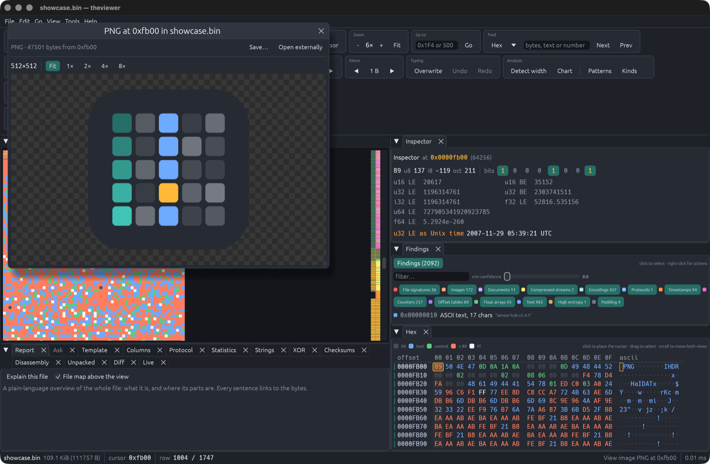

# theviewer

**See the structure in any file.** theviewer draws a file's bytes as pixels,
so headers, tables, text, images and compressed data show up as shapes you
can recognise. Set the width to the record size and the data lines up into
columns. Then inspect, analyse and edit it.

It is built for reverse-engineering file formats, firmware images, captures
and logs, and it stays fast on files of many gigabytes.


<sub>A firmware-like file at 64 bytes per row. Each column of colour is one
field of a 64-byte record. The report at the bottom names what the file
contains and where.</sub>

## Contents

- [Install](#install)
- [A quick tour](#a-quick-tour)
- [What it can do](#what-it-can-do)
- [The tools](#the-tools)
- [Ask Claude about a file](#ask-claude-about-a-file)
- [Make it yours](#make-it-yours)
- [Keyboard shortcuts](#keyboard-shortcuts)
- [Command line](#command-line)
- [Extending it](#extending-it)
- [Development](#development)
- [Licence](#licence)

## Install

You need a Rust toolchain ([rustup](https://rustup.rs)). Then:

```sh
git clone https://github.com/benjaminr/theviewer
cd theviewer
cargo build --release
./target/release/theviewer path/to/file.bin
```

You can also drop a file onto the window, or press `Cmd+O`. Video playback
uses `ffmpeg` if it is installed; everything else is built in.

## A quick tour

1. **Open a file.** Each byte becomes a pixel, row by row. The strip beside
   the scrollbar maps the whole file by entropy: dark for empty space, teal
   for structured data, amber to white for compressed or encrypted data.
2. **Find the width.** Press *Detect width*. theviewer looks for repeating
   patterns and suggests record sizes; pick one and the data snaps into
   columns. You can also drag the *Width* slider, or step it with `[` and
   `]`.
3. **Read what is there.** Click any pixel. The *Inspector* shows that byte
   as every common number type, and the field tree of any structure it
   recognises (a PNG chunk, an ELF header, a ZIP entry and so on). The
   *Findings* list shows everything detected nearby: counters, timestamps,
   text, signatures and compressed streams. *Report* describes the whole
   file in plain sentences, each linked to its bytes.
4. **Dig into the records.** *Columns* profiles each byte position across
   the records, finds counters, timestamps, constants and text, and turns
   them into a template you can apply in one click.

   

5. **Open what is inside.** Images, audio, video and compressed streams
   buried in the file can be opened where they sit. Put the cursor on one
   and press `Cmd+Enter` to view or play it, or `Cmd+D` to decompress.

   

6. **Edit it.** Type hex over a byte, insert, delete, fill, shift bits or
   move a block. Everything can be undone, and `Cmd+S` saves safely through
   a temporary file.

Press `Cmd+K` at any time for the command palette, which lists every action
with its shortcut, or right-click a byte for the actions that apply to it.

## What it can do

**See the data**
- Twelve pixel formats, from 1-bit to 32-bit colour, plus *Byte class*,
  which colours zeros, text, control bytes and high bytes differently.
  Five colour palettes.
- Any width, row padding, and a starting offset down to the bit.
- A hex dump and value inspector that follow the cursor.
- A Hilbert-curve layout that shows structure without choosing a width, and
  arrows from values that look like offsets to the bytes they point at.
- Optional pattern highlights over the view and hex dump (`H`).

**Understand it**
- A period scan that suggests record sizes.
- Detection of counters, timestamps, offset tables, float arrays, text,
  padding, file signatures and compressed streams.
- A catalogue of about 600 file signatures, from Apache Tika's database
  plus a curated set covering firmware, filesystems, bytecode, ROMs and
  protocols.
- Field trees for executables (ELF, PE, Mach-O), images (PNG, JPEG, GIF,
  BMP), archives (ZIP, tar, ar, cpio), packet captures, DER and X.509
  certificates, partition tables and filesystems, and schemaless formats
  such as Protocol Buffers, CBOR and MessagePack.

**Open and extract**
- gzip, zlib, raw deflate, bzip2, xz, lzma, zstd and LZ4 streams are found,
  checked by test decompression, and can be opened as a new document or
  decompressed in place. A selection can be compressed back.
- Images (PNG, JPEG, GIF including animation, BMP, WebP, TIFF, ICO), audio
  (WAV, MP3, FLAC, Ogg Vorbis, AAC, M4A, AIFF, CAF) and video (MP4, MOV,
  WebM, Matroska, AVI, MPEG-TS, FLV, Ogg Theora) play inside the app.
- Any selection, stream or embedded file can be saved to disk or copied as
  hex.

**Edit**
- Overwrite or insert hex, delete, fill, invert, reverse, mirror bits, shift
  a selection's bits across byte boundaries, and move blocks.
- Unlimited undo, on files of any size: edits are recorded, not copied.
- Bookmarks and the view settings are saved beside the file, in
  `name.theviewer.toml`, so you can pick up where you left off.

## The tools

Open a tool from the *Tools* menu, the command palette, or *Analyse* in the
right-click menu. Each one is a panel you can dock anywhere.

| Tool | What it does |
| --- | --- |
| **Report** | A plain-language overview of the whole file, with every sentence linked to its bytes, and a coloured map of the file above the view. |
| **Columns** | For a table of fixed-size records: a profile of each byte position (constant, counter, timestamp, a few values, text, random) and the fields it adds up to. One click applies them as a template. |
| **Protocol** | For captures, serial logs and streams of messages: finds the framing (sync words, delimiters, length prefixes or fixed size), splits the messages, and identifies types, sequence numbers, lengths, timestamps and checksums. |
| **Bits** | For data that is not byte-aligned or not plain binary: finds frame lengths in bits (such as a 37-bit radio frame) and their sync words; shows each bit plane as an image; decodes Manchester, differential Manchester, NRZI, 8b/10b, Gray code and BCD, picking the decoder and bit offset automatically; guesses what the field at the cursor holds (integer, float, fixed-point or a timestamp, and which byte order); and finds length prefixes, tag-length-value chains and offset tables. |
| **Template** | Describe a structure in a small language, such as `struct Chunk { id: char[4]  len: u32  data: bytes[len] }`, and see it decoded as a tree and a table. It can also propose a template from a few selected records. See [docs/templates.md](docs/templates.md). |
| **Statistics** | Byte histogram, randomness tests (entropy, chi-square, serial correlation, Monte Carlo π) with a plain verdict, a byte-pair fingerprint, entropy along the file, and the most repeated sequences. |
| **Strings** | ASCII, UTF-8 and UTF-16 strings, tagged when they look like URLs, paths, IP addresses, UUIDs, versions or keys. |
| **XOR** | Recovers single-byte and repeating XOR keys. Preview the result or apply it as an edit. |
| **Crypto** | Spots ECB-style encryption from repeated cipher blocks; finds PEM and DER certificates and keys, OpenSSH keys and likely raw keys; and tries rolling XOR, ADD, rotation and combined ciphers, or drags a known plaintext such as `PK\x03\x04` across the data to reveal the key. Decodes open as a document or apply as an edit. |
| **Disassembly** | x86, ARM, RISC-V, MIPS and PowerPC, with the architecture read from executable headers or guessed, and branch targets you can follow. |
| **Unpacked** | Extracts ZIP, tar and compressed streams recursively into a tree you can browse, open or save. |
| **Checksums** | CRC-32, Adler-32, MD5, SHA-1, SHA-256 and simple sums of a selection, and *Find the checksum*, which works out which stored value checks which bytes. |
| **Diff** | Compares with another file, finding inserted and deleted bytes rather than only changed ones, and scrolls both together. |
| **Compare** | Many files at once (captures, firmware versions, saved states): which byte ranges stay constant, vary or count up across them; which fields follow a value you enter for each file, such as a temperature or a setting; and, for a live recording, a timeline of which bytes changed when. |
| **Live** | Opens a URL, a serial port (`serial:/dev/cu.usbserial@115200`), a block device (`/dev/rdisk2`, needs sudo) or process memory (`pid:1234`, Linux only). Can watch a file as it grows and record its history. |
| **Ask** | Ask Claude about the file (see below). |

Also in the menus: *Plot selection* draws bytes as a time series, histogram,
scatter or frequency spectrum, and *Play selection as audio* plays any bytes
as sound.

## Ask Claude about a file

*Ask* (`Cmd+L`) lets you ask questions such as "what format is this?" or
"which field is the length?". Claude (`claude-opus-5-5`) sees the cursor,
the selection, nearby findings and the bytes around them, and can read,
search and parse more of the file itself. Offsets in its answers are links,
and templates it writes can be applied with one click.

Ask is off until you add an Anthropic API key in **Settings** (`Cmd+,`).
On macOS the key is kept in your Keychain; elsewhere in
`~/.config/theviewer/credentials`, readable only by you. The
`ANTHROPIC_API_KEY` and `ANTHROPIC_AUTH_TOKEN` environment variables, or an
`ant auth login` session, also work. Nothing is sent anywhere unless you ask
a question.

## Make it yours

**Arrange the panels.** Every panel can be moved:

- **Split or stack:** drag a panel's tab to the edge of another panel to put
  it beside that one, or onto its tab bar to stack it there.
- **Float:** drag it out of the window.
- **Collapse or close:** the arrow collapses a panel and the cross closes it.
  *View › Panels* brings a closed panel back.
- **Presets:** *View › Layout* has Default, Everything on the right, Tools on
  the left, and Focus on the view.
- **Tools:** `Cmd+J` folds all the tools away.

Panels with many tabs wrap them onto extra rows.

**Arrange the toolbar.** The toolbar's groups pack themselves into as few
rows as the window allows. Drag a group by its caption to put it somewhere
else; *View › Layout › Arrange toolbar automatically* undoes that.

**Choose the defaults.** In **Settings** (`Cmd+,`), choose what a new window
starts with:

- pattern highlights, and which kinds to show;
- whether the findings list is open;
- pixel format, palette, width and zoom;
- whether to detect the width when a file opens.

A file's own saved view and command-line options still take precedence.

**Where things are saved**

| File | Holds |
| --- | --- |
| `~/.config/theviewer/layout.json` | Panel arrangement |
| `~/.config/theviewer/toolbar.json` | Toolbar order, if you rearranged it |
| `~/.config/theviewer/preferences.json` | Startup defaults |
| `~/.config/theviewer/credentials` | API key (not on macOS, which uses the Keychain) |
| `name.theviewer.toml`, beside each file | Bookmarks and the view settings for that file |

## Keyboard shortcuts

Shortcuts use `Cmd` on macOS and `Ctrl` elsewhere. Press `?` in the app for
the full list.

| Keys | Action |
| --- | --- |
| `Cmd+K` | Command palette |
| `Cmd+O` `Cmd+S` `Shift+Cmd+S` `Cmd+N` | Open, save, save as, new |
| `Cmd+Z` `Shift+Cmd+Z` | Undo, redo |
| `Cmd+F`, `F3`, `Shift+F3` | Find; next and previous match |
| `Cmd+G` | Go to an offset |
| `Cmd+B`, `F2`, `Shift+F2` | Bookmark; next and previous bookmark |
| `0`–`9` `A`–`F` | Type hex at the cursor |
| `Ins` | Switch between overwrite and insert |
| Arrow keys | Move by a pixel or a row (`Shift` extends the selection) |
| `PgUp` `PgDn` `Home` `End` | Move by a page, or to either end |
| `Delete` `Backspace` | Delete the selection or byte |
| `Cmd+C` `Cmd+X` `Cmd+V` `Cmd+A` | Copy as hex, cut, paste, select all |
| `[` `]` | Width −1 / +1 (`Shift` for 16) |
| `,` `.` | Start offset −1 / +1 byte |
| `Alt+←` `Alt+→` | Start offset −1 / +1 bit |
| `-` `+` | Zoom out, zoom in |
| `H` | Pattern highlights on or off |
| `Cmd+Enter`, `Space` | Open the media at the cursor; play and pause |
| `Cmd+D` | Switch between a compressed block and its contents |
| `Cmd+E` | Save the selection or stream to a file |
| `Cmd+[` | Back to the parent document |
| `Cmd+J` | Fold the tools away or back |
| `Cmd+L` | Ask Claude |
| `Cmd+,` | Settings |
| `Esc` | Clear the selection |
| `?` | Shortcut window |

## Command line

```sh
theviewer firmware.bin --format rgb8 --width 320 --offset 0x1000 --zoom 2
theviewer records.dat --detect
theviewer capture.bin --tool protocol --layout right
theviewer firmware.bin --report          # print the report, no window
theviewer firmware.bin --json > report.json
```

| Option | Effect |
| --- | --- |
| `--format NAME` | Pixel format: `bit1` `bit1lsb` `nibble4` `gray8` `class` `rgb565` `gray16le` `gray16be` `rgb8` `bgr8` `rgba8` `bgra8` |
| `--palette NAME` | Palette for single-channel formats: `grey` `viridis` `inferno` `ocean` `amber` |
| `--width PIXELS` | Pixels per row |
| `--offset BYTES` | Byte shown at the top left (decimal or `0x` hex) |
| `--cursor BYTES` | Where the cursor starts |
| `--zoom FACTOR` | Pixel scale, such as `2` or `0.5` |
| `--detect` | Look for the record width straight away |
| `--open` | Open the image, audio or video at the cursor |
| `--tool NAME` | Open a tool: `report` `ask` `template` `columns` `protocol` `statistics` `strings` `xor` `checksums` `disassembly` `unpacked` `diff` `live` |
| `--layout NAME` | Start with a panel layout: `default` `right` `left` `focus` |
| `--report` | Print the file's report as text and exit, without opening a window |
| `--json` | Print the report as JSON and exit: the summary, regions, likely record widths and confident findings, for scripts and CI |

## Extending it

Everything that recognises, parses or decodes bytes is a plugin, and the
built-in ones use the same interfaces as yours.

- **Signatures:** add TOML files to `~/.config/theviewer/catalog/`. The
  format, with offsets, masks, nested conditions and length rules, is the
  one used in `catalog/curated.toml`.
- **Templates:** describe structures in the template language; see
  [docs/templates.md](docs/templates.md).
- **Lua plugins:** scripts can add detectors, parsers, codecs and actions
  through a small sandboxed API; see [docs/plugins.md](docs/plugins.md) and
  the examples in `plugins/`. *View › Reload plugins* picks up changes.
- **Rust:** implement `Detector`, `Parser` or `CodecPlugin` from
  `src/plugin.rs` and register it in the `Registry`.

## Development

```sh
cargo test                  # unit tests, plus headless UI tests
cargo clippy --all-targets
cargo run --bin render_logo -- assets/logo.png   # redraw the logo
```

`tests/ui.rs` and `tests/tools.rs` drive the real application without a
window, using `egui_kittest`. They click, drag and type through the view,
the toolbar, every tool, the panel layouts and the settings, so a change
that breaks an interaction fails a test. They use a temporary key store,
never your Keychain.

<details>
<summary><strong>How the code is organised</strong></summary>

| Module | Responsibility |
| --- | --- |
| `document.rs` | Piece table over a memory-mapped file plus an append-only edit buffer: cheap edits on any size, undo and redo, and safe saving. |
| `raster.rs` | Turns bytes into pixels for a format, palette and row stride, in parallel. |
| `view.rs` `hex.rs` | The raster view (texture caching, scrolling, zoom, selection) and the inspector and hex dump. |
| `app.rs` | Application state, shortcuts, editing commands, toolbar, menus and background analysis. |
| `analysis.rs` `structure.rs` | Period scan, column entropy and the entropy map; the period chart. |
| `patterns.rs` | Pattern recognisers and how overlapping findings are resolved. |
| `plugin.rs` | The plugin traits, `Finding`, `Field`, `Category` and the `Registry`. |
| `catalog.rs` | The signature catalogue and its matching engine. |
| `parsers/` | Structure parsers for executables, images, archives, captures, ASN.1, disks and serialisation formats. |
| `plugins.rs` | The sandboxed Lua plugin host. |
| `compress.rs` `unpack.rs` | Stream detection, bounded decompression and compression; recursive extraction. |
| `media.rs` `player.rs` | Media detection and decoding; the image, audio and video viewer. |
| `explain.rs` `hilbert.rs` | The whole-file report and map; the Hilbert-curve layout. |
| `columns.rs` `protocol.rs` `templates.rs` | Record profiling, protocol analysis, and the template language. |
| `stats.rs` `strings.rs` `xor.rs` | Statistics and randomness tests, strings, XOR key recovery. |
| `disasm.rs` `pointers.rs` `checksums.rs` `diff.rs` | Disassembly, the pointer graph, checksums, file comparison. |
| `sources.rs` `plot.rs` | Live sources, watching and recording; plots and bytes as audio. |
| `analysis_tools.rs` `analysis_stats.rs` `analysis_tabs.rs` `dock.rs` `workbench.rs` | The tool panels and the state behind them. |
| `assistant.rs` | *Ask*: a streaming Claude API client with tools, on a background thread. |
| `layout.rs` `packing.rs` | Dockable panels and presets; toolbar packing and reordering. |
| `search.rs` `bookmarks.rs` `findings.rs` `commands.rs` | Search, bookmarks and the sidecar file, the findings list, the command palette. |
| `settings.rs` `preferences.rs` `config.rs` | The settings window and API key storage; startup defaults; where settings live. |
| `theme.rs` `logo.rs` | Colours and shared widgets; the logo, drawn in code. |
| `vendor/egui_dock` | egui_dock 0.21.1 with one addition, wrapping tab bars (`TabBarStyle::wrap_tabs`). |

</details>

## Licence

Licensed under either of the [MIT licence](LICENSE-MIT) or the
[Apache License 2.0](LICENSE-APACHE), at your option.

Bundled third-party material keeps its own licence:
`catalog/tika.toml` is derived from Apache Tika (Apache-2.0, see
`catalog/LICENSE-tika.txt`), and `vendor/egui_dock` is a modified copy of
egui_dock (MIT, see `vendor/egui_dock/LICENSE`).
